## Introduction

FBLA Chapter Management Platform

1.	Membership
   - Integrated membership form (coming soon)
   - Paid member tracking
   - Member onboarding 
   - End of school year membership letters (coming soon)

2.	Chapter Meetings/Events
   - Integrated calendar with chapter meetings and events
   - Chapter meetings scheduler
   - Notifications for meetings & events (coming soon)
   - Meeting attendance capabilities
       * Attendance location verification (coming soon)
   - Integrated meeting links to presentations, meeting notes, or meeting link

3.	Competitive Events
  1.	Competitive event signups
    *	Team/Individual validation
    *	Intro event validation against member grade
    *	Group A/B/C validation
    *	Promotion to SLC 
    *	Promotion to NLC (coming soon)
  2.	Notifications for team event signups
  3.	Competitive events resources

4.	Chapter Officer Elections
  1.	Election signups (coming soon)
  2.	Election campaigning (coming soon)
  3.	Voting (coming soon)
  4.	Election results (coming soon)

5.	Chapter Resources
  1.	Integrated list of chapter officers
  2.	Integrated list of advisers and contact details
  3.	Direct chapter web site access 
  4.	Integrated quick links
  5.	FAQ

6.	Chapter Maintenance
  1.	Integrated platform refresh for new membership year


<br/><br/>
## Table of Contents

- [Installation & Project Configuration](#installation)
  - [General Installation Steps](#general)
  - [Setting up Firebase Console](#console)
  - [Setting up Firebase Billing](#billing)
  - [Setting up Email Service Provider](#email)
  - [Setting up Firebase Firestore and Authentication services](#firestore-auth)
  - [Completing Project Set Up](#completing)
  - [Hosting on Website](#hosting)
  - [Last steps](#laststeps)
- [Developer](#developer)
- [License](#license)


<br/><br/>
## Installation & Project Configuration <a name = "installation"></a>

### General Installation Steps <a name = "general"></a>

---

[Fill out this Google Form](https://forms.gle/3USTZkTHqKwXqdTn9)

---

1. Fork this repo
2. Install **node.js**
 - Install node.js following these [instructions](https://nodejs.org/en/download/)
3. Clone the forked repo following these [steps under "Cloning a repository"](https://docs.github.com/en/repositories/creating-and-managing-repositories/cloning-a-repository#cloning-a-repository)
4. Opened the cloned repo in a code editor, like Webstorm, PyCharm, Atom, VSCode, etc.

### Setting up Firebase Console <a name = "console"></a>

3. Navigate to [Firebase Console](https://console.firebase.google.com/)
  - Sign into the Google account you would like to use to manage this platform
4. Click "Create New Project", entering the name of your chapter in lowercase (ex. washingtonfbla)
5. Uncheck the "Enable Google Analytics for this project" checkbox
6. Click "Create Project"
7. Navigate to "Project Overview"


8. Click on "web"

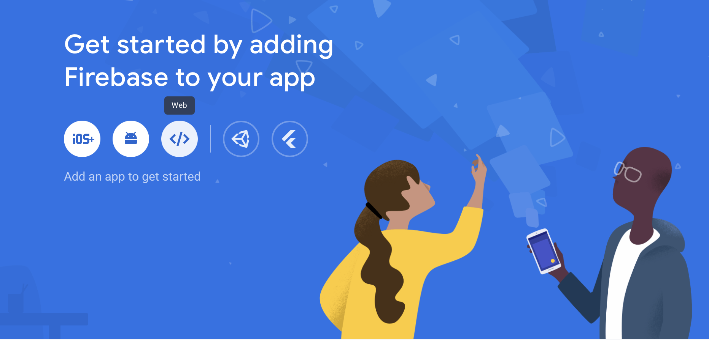

9. Enter chapter name as app nickname (ex. Washington FBLA) and check "Also set up Firebase Hosting for this app", and click Register

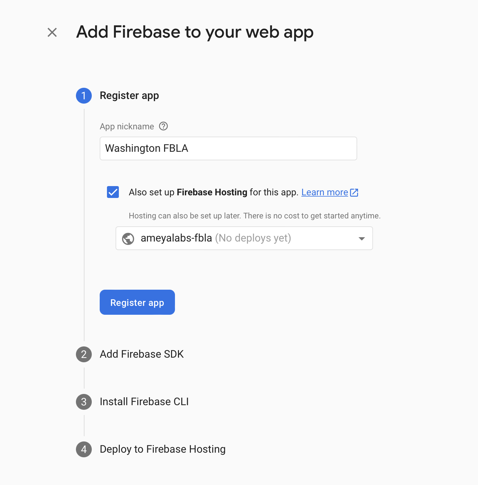

10. Ignore the code under "Add Firebase SDK" step. Instead, copy the code under "// Your web app's Firebase configuration"

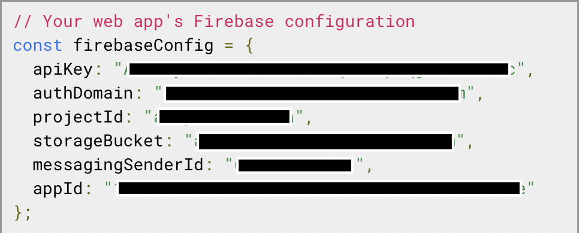

11. Open your code editor with the project open (from the previous part) and create a new file called ".env" in the same level as chaptersUsing.txt


12. Copy the following code into the newly created .env file

```
REACT_APP_API_KEY=
REACT_APP_AUTH_DOMAIN=
REACT_APP_PROJECT_ID=
REACT_APP_STORAGE_BUCKET=
REACT_APP_MESSAGING_SENDER_ID=
REACT_APP_APP_ID=
```

13. Add the keys that you copied from step 10 into the .env file, WITH NO quotation marks (""). The final .env file should look like this...

```
REACT_APP_API_KEY=AIS92kmis-flKO-2Msk_sP092mf4
REACT_APP_AUTH_DOMAIN=washingtonfbla.firebaseapp.com
REACT_APP_PROJECT_ID=washingtonfbla
REACT_APP_STORAGE_BUCKET=washingtonfbla.appspot.com
REACT_APP_MESSAGING_SENDER_ID=1298038129
REACT_APP_APP_ID=9:2981238017:web:dj0293sl3989rbs92
```

14. You can save and close the .env file. 
15. Return to the Firebase Console and click next so you see this.

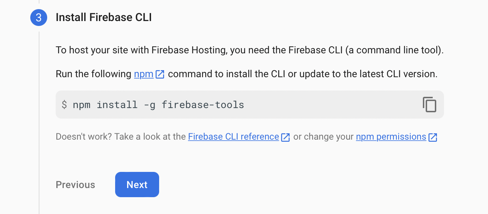

16. Click next and skip the "Deploy to Firebase Hosting" section. Click the "Continue to console" blue button.

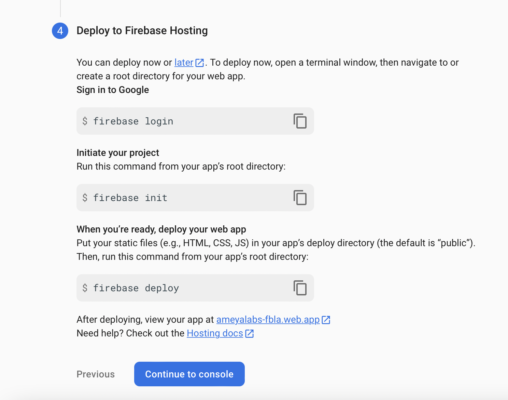

### Setting up Firebase Billing <a name = "billing"></a>

17. Navigate to https://console.firebase.google.com/u/0/project/[CHAPTER_NAME_FROM_STEP_4_HERE]/usage/details
18. On this page, click on "Modify plan" and then select "Blaze" "Pay as you go" plan.
20. Clicking "Continue" you should be taken to Google Cloud console to set up a billing account as seen below.


21. Follow the billing steps to set up a billing account - creating a Business account and linking a credit/debit card or bank account.
22. Once you finish, you will be taken back to Firebase Console.
23. (optional) Set a billing budget if asked
24. If you completed the steps correctly, you will see a popup similar to this.


### Setting up Email Service Provider <a name = "email"></a>

The project uses a Gmail service provider to be able to send automated emails when members create competitive event teams.

25. Open a new tab and navigate to Create a [New Google Account](https://accounts.google.com/signup)
26. Create a new Google account with the first name being your chapter name and last name being "FBLA"
27. Create the email following the following format `noreply.auto.[CHAPTER NAME IN LOWERCASE FROM STEP 4]@gmail.com` (ex. noreply.auto.washingtonfbla@gmail.com)
28. Create a password and save it (you will need this password in the future). Complete the rest of the account creation steps.
29. Turn on [2-Step verifcation for this new Google account (REQUIRED)](https://support.google.com/accounts/answer/185839?hl=en&co=GENIE.Platform%3DiOS&oco=0)
30. Navigate to App [Passwords](https://myaccount.google.com/apppasswords)
31. Create a new App Password for "Other (Custom name)", naming it "Firebase".

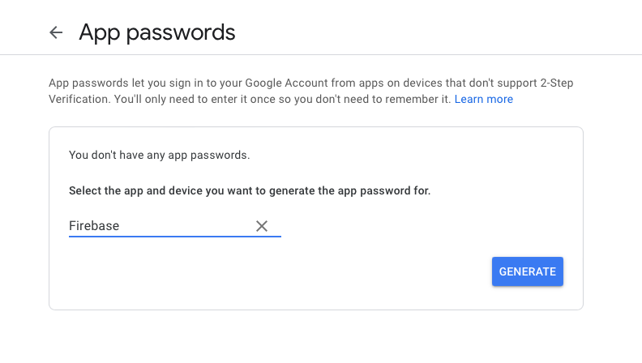

32. Click Generate, and save the app password that is in yellow. You will need this password in the future.
33. Navigate to [this link](accounts.google.com/b/0/DisplayUnlockCaptcha) and complete the steps.
34. Navigate to [Firebase Trigger Email Extension](https://firebase.google.com/products/extensions/firebase-firestore-send-email) and click "Install in console". Select your FBLA chapter firebase project from the list.
35. A 4-step set up window will open. Please read step 1, acknowledge, and click Next.
36. In Step 2, enable the following options, and then click Next.

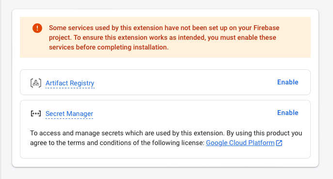

37. Step 3 includes information about how Google Cloud permissions will be updated. You can read through this or ignore and click Next.
38. Step 4 will ask you to configure the extension. Fill in the following data into the respective fields, and leave all other fields that are not listed below blank. Click "Create secret" once you enter the SMTP password.
```
Cloud Functions location:   Iowa (us-central1)
SMTP connection URI:        smtps://[EMAIL FROM STEP 27 HERE]@smtp.gmail.com:465
SMTP password:              [APP PASSWORD FROM STEP 32]
Email documents collection: mail
Default FROM address:       [CHAPTER NAME HERE] <[EMAIL FROM STEP 27 HERE]>
Default REPLY-TO address:   [CHAPTER/ADVISER EMAIL ADDRESS HERE]
Templates collection:       email_templates
```
Example:
```
Cloud Functions location:   Iowa (us-central1)
SMTP connection URI:        smtps://noreply.auto.washingtonfbla@gmail.com@smtp.gmail.com:465
SMTP password:              ksloeptnsjeiomgs
Email documents collection: mail
Default FROM address:       Washington FBLA <noreply.auto.washingtonfbla@gmail.com>
Default REPLY-TO address:   washingtonfbla.chapter@gmail.com
Templates collection:       email_templates
```
39. Click on "Install extension" and wait 3-5 minutes as it installs into your project.

### Setting up Firebase Firestore and Authentication services <a name = "firestore-auth"></a>

40. Navigate to the Firestore Database tab under Build.


41. Click "Create Database" and click "Next" without changing anything under "Secure rules for Cloud Firestore".
42. On step 2, ensure the Cloud Firestore location is nam5 (us-central) and click Enable.

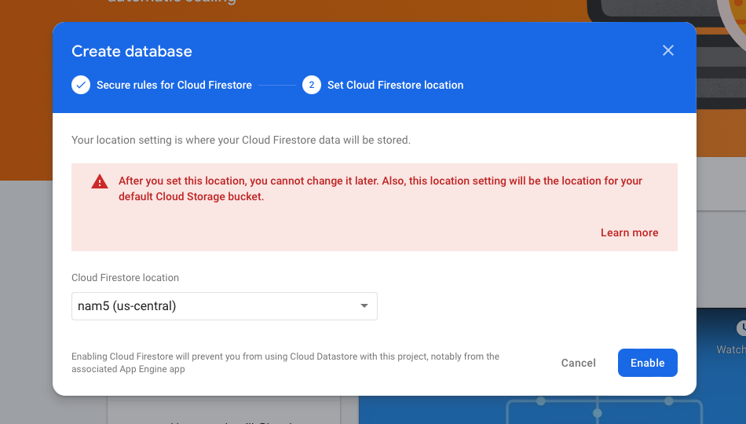

43. Navigate to "Authentication" under "Build" (left side bar), similar to step 40.
44. Click "Get started". Click on "Email/Password" option as shown below.

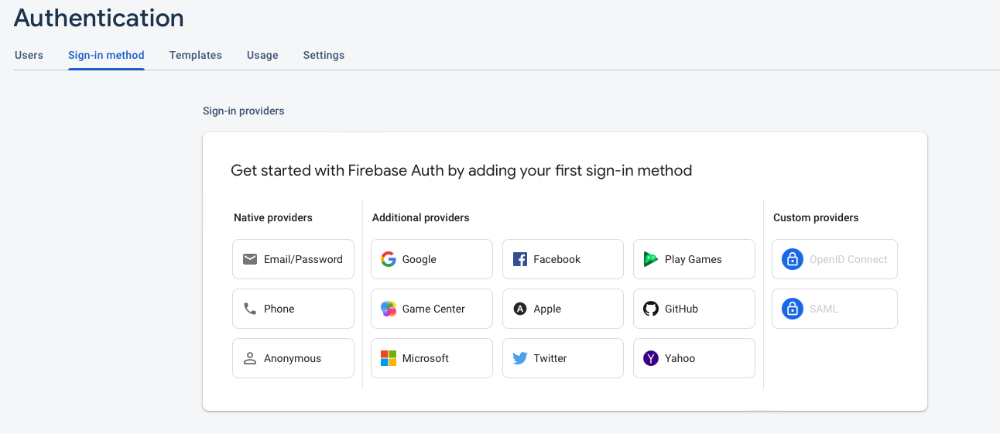

45. Enable ONLY the first option, and click Save.

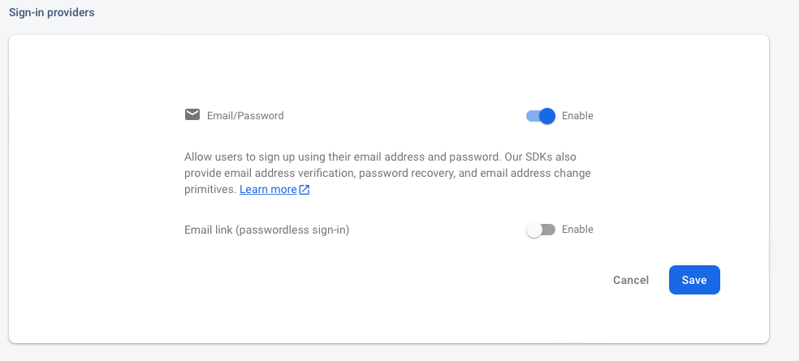

### Completing Project Set Up <a name = "completing"></a>

46. Navigate back to your project in your code editor.
47. Edit the settings.js file under `src/settings.js`
  - You can edit these variables in this file to customize the look and information on the platform.
48. Add your chapter images under `/src/assets`.
'''
chapter-icon.png
landing-page-img.jpg
logo.svg
'''
will need to be updated. You can convert a regular image to SVG using [this online converter](https://convertio.co/jpg-svg/). Also update `favicon.ico` under `/public`. You can convert a regular image to ICO using [this online converter](https://convertio.co/png-ico/).
49. Once you have updated these files, complete the following commands in a Terminal/CMD window in your project folder, one at a time.
```
npm install
npm install -g firebase-tools
```

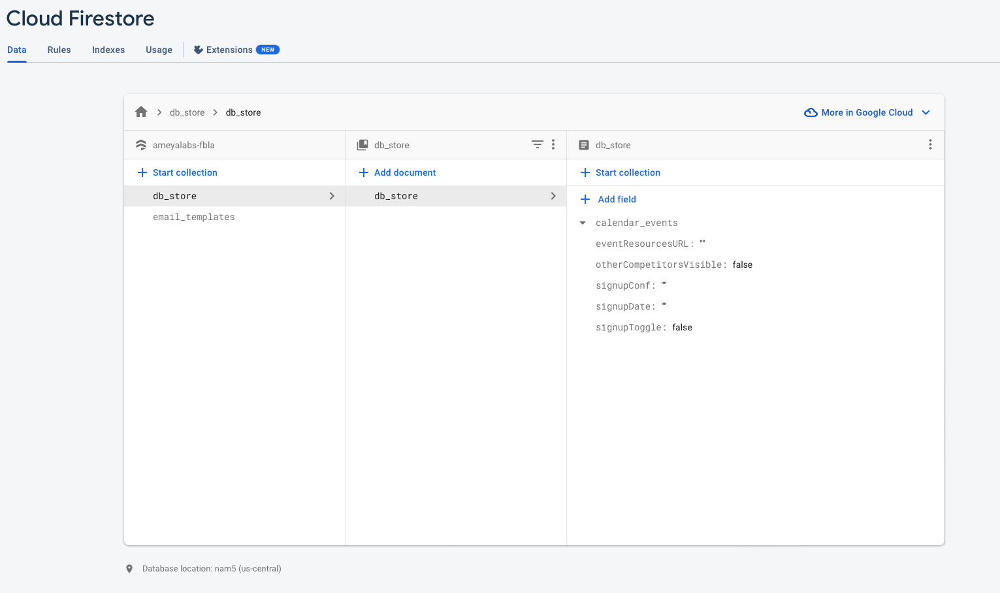

### Hosting on Website <a name = "hosting"></a>

Now that all the code and services are set up, one of the last steps is hosting onto a website. We will use Firebase Hosting for this.

50. Run `firebase login` in a Terminal/CMD window in your project folder. Follow the login steps that appear.
51. Run `firebase init`, and follow the steps in the images below, selecting the same options (IMPORTAN: Say "N" to all prompts asking to overwrite any files).

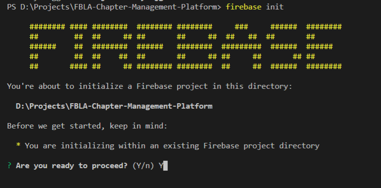

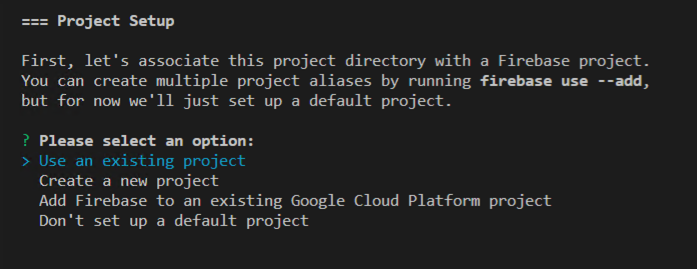
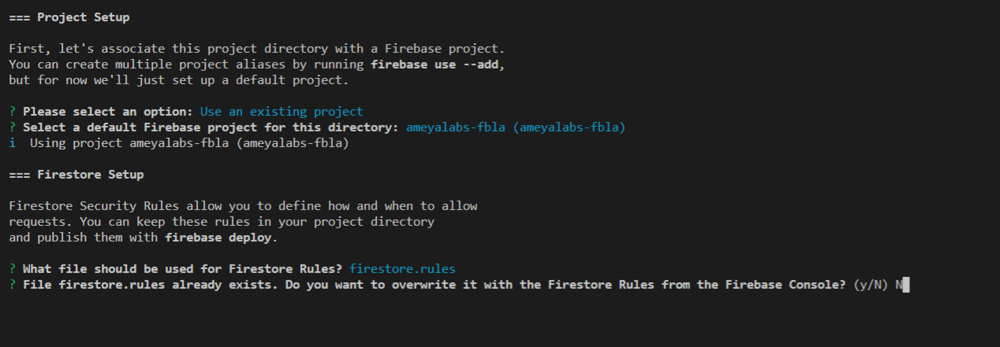


52. Run `npm run build`
53. Run `firebase deploy`

The platform should be live on the Firebase website. An example site is ameyalabs-fbla.web.app/. In your Firebase Console -> Cloud Firestore, you should see new data under "db_store" and "email_templates". An Adviser account has temporarily been created so you can log into the system and make youself an account. Please be sure to delete this temp Adviser account once you successfully create an account for yourself.

The temp Adviser account credentials are...
```
Email: ameyalabs-fbla@gmail.com
Password: AmeyaLabsFBLA123
```

### Last steps <a name = "laststeps"></a>

54. Navigate to "Rules" tab of "Cloud Firestore" in the Firebase console. Replace the current rules you see with the following...
```
rules_version = '2';
service cloud.firestore {
  match /databases/{database}/documents {
    match /{document=**} {
      allow read, write: if request.auth != null;
      allow read;
    }
  }
}
```


55. You can use [this filled out Competitive Events list](https://github.com/akjadhav/FBLA-Chapter-Management-Platform/blob/main/public/csv_templates/events_template_filled.xlsx) to intially upload into your management platform.


<br/><br/>
## Developer <a name = "developer"></a>

[Ameya Jadhav](http://ameyajadhav.su.domains) of [Ameya Labs](https://www.linkedin.com/company/ameya-labs)

[See other developers](https://github.com/Ameya-Labs/FBLA-Chapter-Management-Platform/blob/main/AUTHORS.txt)

<br/><br/>
## License <a name = "license"></a>

This project is licensed under the terms of the [MIT license](https://github.com/akjadhav/FBLA-Chapter-Management-Platform/blob/main/LICENSE.md).
