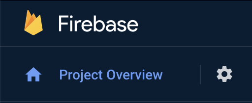

## Introduction

FBLA Chapter Management Platform
-  FBLA competitive event signup
  - Emails to teams
  - Group validation
  - Intro event validation
  - Automatic in-house checking
  - Validation etc etc
- Chapter meetings scheduler
- Chapter meetings attendance platform
- Calendar integration for chapter meetings and any events/conferences

## Table of Contents

- [Developer](#developer)
- [License](#license)

## Installation & Project Configuration

### General Installation Steps

1. Fork this repo
2. Install **node.js**
 - Install node.js following these [instructions](https://nodejs.org/en/download/)
3. Clone the forked repo following these [steps under "Cloning a repository"](https://docs.github.com/en/repositories/creating-and-managing-repositories/cloning-a-repository#cloning-a-repository)

### Setting up Firebase Console

3. Navigate to [Firebase Console](https://console.firebase.google.com/)
  - Sign into the Google account you would like to use to manage this platform
4. Click "Create New Project", entering the name of your chapter in lowercase (ex. washingtonfbla)
5. Uncheck the "Enable Google Analytics for this project" checkbox
6. Click "Create Project"
7. Navigate to "Project Overview"

8. Click on "web"

9. 

Notes:

* Install Node.js
* Set up Firebase project
* Set up Cloud billing
* Set up .env db tokens

* Set up cloud functions
* Set up Firebase
* Set up STMP email service
* Install firebase email extension
 * Create new Gmail account
 * Enable 2FA
 * Create App Password
 * Visit accounts.google.com/b/0/DisplayUnlockCaptcha

* (possibly) set up Github actions ???? - Need to add github secrets
* Set up settings.js file
* Update images - /src/assets (https://github.com/akjadhav/FBLA-Chapter-Management-Platform/tree/master/src/assets)
  * chapter-icon.png
  * landing-page-img.jpg
  * logo.svg
* Update school info into .txt file
* Node script to create db collections (probably only db_store and email_templates)
* Update chaptersUsing.txt

## Available Scripts for npm 

In the project directory, you can run:

### `npm start`

Runs the app in the development mode.\
Open [http://localhost:3000](http://localhost:3000) to view it in your browser.

The page will reload when you make changes.\
You may also see any lint errors in the console.

### `npm test`

Launches the test runner in the interactive watch mode.\
See the section about [running tests](https://facebook.github.io/create-react-app/docs/running-tests) for more information.

### `npm run build`

Builds the app for production to the `build` folder.\
It correctly bundles React in production mode and optimizes the build for the best performance.

The build is minified and the filenames include the hashes.\
Your app is ready to be deployed!

See the section about [deployment](https://facebook.github.io/create-react-app/docs/deployment) for more information.

## Developer 

[Ameya Jadhav](http://ameyajadhav.su.domains) of [Ameya Labs](https://www.linkedin.com/company/ameya-labs)

## License 

This project is licensed under the terms of the [MIT license](https://github.com/akjadhav/FBLA-Chapter-Management-Platform/blob/main/LICENSE.md).
